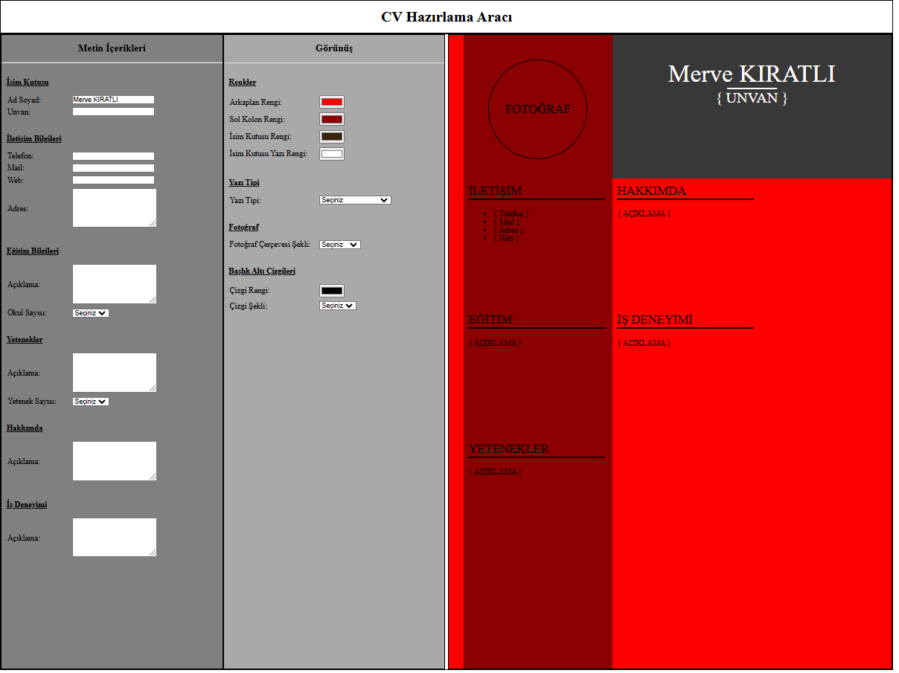

# Dynamic CV Builder Tool

This project is a dynamic CV builder tool created using HTML, CSS, and JavaScript. The purpose of the project is to generate a CV dynamically by allowing users to input personal information, skills, education, and other details. The changes are applied in real-time as the user interacts with the input fields.

## Screenshot

## Project Purpose

The goal of this project is to create a fully functional CV tool where:
1. The user can enter details such as personal information, education, skills, and work experience.
2. CSS properties like colors and fonts can be adjusted dynamically.
3. Every change is reflected immediately on the CV preview.

## Features

### 1. Input Sections
The CV builder includes the following sections for user input:
- **Name**: A section for entering the user's name.
- **Contact Information**: Inputs for phone number, email, and address.
- **Education**: Users can select the number of schools (1, 2, or 3) they want to add. For each school, input fields for the school name and description are provided.
- **Skills**: Similar to the education section, users can add multiple skills with a description for each.
- **About Me & Work Experience**: Text areas where users can provide a brief description about themselves and their past work experience.

### 2. Appearance Settings
In the middle column, users can modify the appearance of the CV by:
- **Selecting Background Colors**: Options to change background color, left column color, name box color, and name box text color.
- **Choosing Fonts**: A dropdown menu with font options such as Times New Roman, Courier New, and Lucida Handwriting.
- **Photo Styling**: Users can choose the shape of the photo area (e.g., circle, square, or rounded rectangle).
- **Header Line Styling**: Users can customize the lines under section headers (e.g., dotted, dashed, or solid lines).

### 3. Real-Time Update
All inputs and changes to appearance settings are reflected immediately on the CV preview without requiring a refresh.

## How to Use
1. Clone the repository to your local machine.
2. Open `index.html` in a web browser.
3. Fill in the input fields to generate your CV.
4. Adjust the appearance settings to style the CV according to your preference.
5. Save or print the generated CV.

## Technologies Used
- **HTML**: For the structure of the CV builder tool.
- **CSS**: For styling the tool and the generated CV.
- **JavaScript**: For dynamic updates and real-time changes.

## Project Structure
The project is organized as follows:

dynamic-cv-builder/
├── css/
│   └── style.css         # Styling for the tool and CV layout
├── js/
│   └── script.js         # JavaScript for dynamic functionality
├── index.html            # Main HTML file
└── README.md             # Project documentation

## Example Output
Below is a sample output generated by the tool:

*(Add screenshots or images of the CV builder interface and the resulting CV here.)*

## Future Improvements
- Add more customization options for layout and design.
- Enable downloading the CV as a PDF.
- Implement local storage to save progress.

## Author
**Merve KIRATLI**
